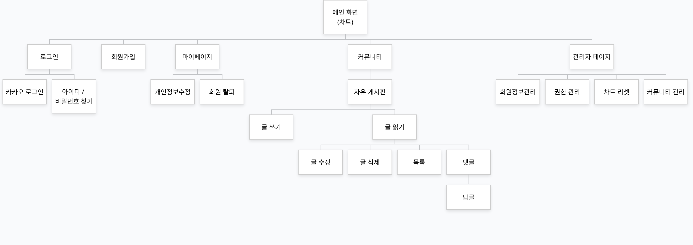

# Last Carnival(~2023.04.12)

+ 배포 링크 : [Last Carnival 링크](http://34.64.74.137:8080/)

​

## 목적 
해외 음원 차트가 포함된 커뮤니티 웹 사이트

## 프로젝트 배경
- 현재 대부분의 국내 음원 사이트들은 해외 음원을 다루지 않고 있음
- 국내 음원 사이트 이용자들의 경우, 해외 차트도 이용하길 원하는 needs가 존재하는 것을 확인
- 해외 음원 차트 기능이 포함 된 커뮤니티의 필요성을 통해 본 프로젝트를 진행

## 데이터
+ last.fm api - 해외음원차트, 앨범 이미지
+ yotube api - 음원차트내 뮤직비디오 URL

[last.fm api](https://www.last.fm/api)

[last.fm api 발급 방법](https://terrific-close-029.notion.site/last-fm-api-key-29b995f2c4294d16ac82bff432939a7b)

[yotube api](https://developers.google.com/youtube/v3?hl=ko)

[youtube api 발급 방법](https://terrific-close-029.notion.site/youtube-api-key-46556000dd57468691bafacfdf603aac)

## 사이트맵

## ERD

## 개발 환경
- 사용 언어
  +      
- 프레임워크
  +     
- 사용 Tools
  +    
- 라이브러리
  +       
- 사용 DB :  
- 참조 API :   
- 협업 Tools :  
- 웹 IDE : 

- 배포 서버 환경 : Google Cloud Platform
    - 머신 구성 : e2-small
    - 부팅 디스크 : Ubuntu 20.04 LTS
    - 지역 : asia-northeast3-a

- DB 서버 환경 : 

    MongoDB Atlas
    - Version : 5.0.15
    - Data Size : 512MB
    - 지역 : GCP Seoul(asia-northeast3)
    - 용도 : 차트정보 및 앨범커버 이미지

    Cloud SQL
    - 데이터베이스 엔진 : MySQL
    - Version : 8.0
    - Data Size : 100GB
    - 지역 : asia-northeast3-a
    - 용도 : 회원정보, 게시판정보, 댓글정보, 로그인유지, 회원권한, 회원소셜구분

## 프로젝트 기간
- 2023-03-23 ~ 2023-04-04

## 팀구성
- 사용언어 : Java 17.0.4.1
- 작업툴 : VS code
- 인원 : 4명
- 주요업무 : Spring boot 프레임워크를 이용한 웹개발 구현 코드 작성
    + 나의 업무 : 프로젝트 리더로서 프로젝트를 이끌었습니다. Google Cloud Platform을 사용해 배포를 시작으로 MongoDB Atlas, Cloud SQL(My SQL)을 이용한 DB 서버 구축, OkHttp를 이용한 API 데이터 가져오는 업무, DB에 이미지 저장과 업로드, 회원정보 조회, 수정, 삭제 기능, 차트페이지, 프로필페이지를 맡았습니다.
- 기간 : 2023-03-22 ~ 2023-04-12
***

## 주요 기능
- 게시판
- 소셜 회원가입(카카오)
- 관리자 페이지

<h2>프로젝트 리뷰</h2>

<h3>메인 화면</h3>

- 해외 음원 차트 50개를 보여 줌

- 앨범 이미지, 유튜브 이미지 눌렀을 때 유튜브 링크로 이동

***

<h3>회원가입</h3>

- 중복확인 한개라도 수행 안할 시 등록이 안됨

- 유효성 검사

- 회원가입 완료 시 자동 로그인

***

<h3>프로필</h3>

- 내 정보 수정

  - 이메일 변경 시 중복확인 및 유효성 검사
  

  - 비밀번호 변경 시 유효성 검사
  

***

<h3>로그인</h3>

- 아이디 저장 및 자동 로그인 기능
  - 아이디 저장 : 로그인 시 아이디 자동 입력
- 카카오 로그인

***

<h3>아이디 / 비밀번호 찾기</h3>

- 비밀번호 찾기 수행 시 비밀번호는 임시 비밀번호로 변경

***

<h3>커뮤니티</h3>

- 로그인 여부

- 게시글 및 댓글 

***

<h3>관리자</h3>

- 회원관리

- 닉네임 변경 및 회원 삭제

- 권한 관리

- 게시물 관리

***

## 한계
- 같은 이메일의 일반회원 & 소셜회원일 경우 동일 session 부여를 통해 같은 ID로 처리하고자 했으나 Access Token과 같은 추가정보를 불러오는 데 어려움을 겪어 실패하였음
- 회원 탈퇴 시 작성했던 댓글에 대한 처리가 원활하지 못함

## 참조
- 카카오 로그인 document: https://developers.kakao.com/docs/latest/ko/kakaologin/common
- Last.fm API: https://www.last.fm/api
- Youtube API: https://developers.google.com/youtube/v3/getting-started?hl=ko

## 자기소개
[자기소개](https://github.com/SeungKyu37/resume)

